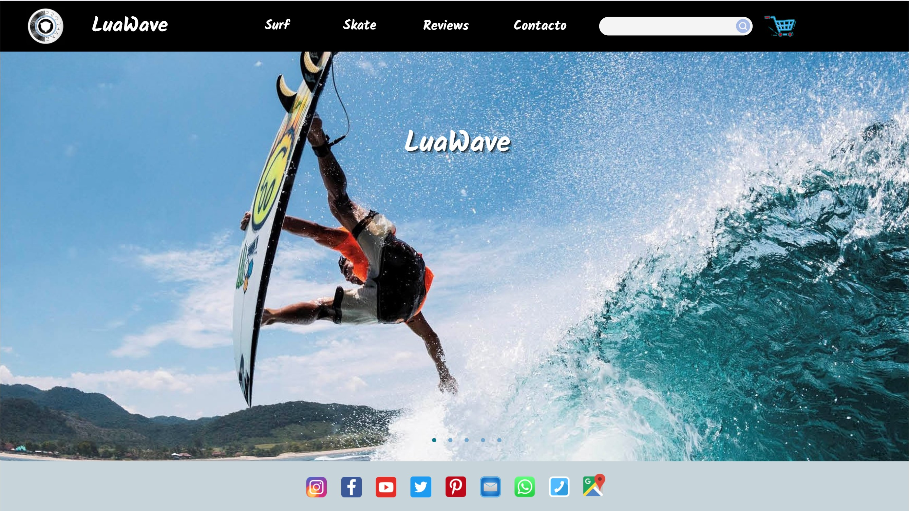
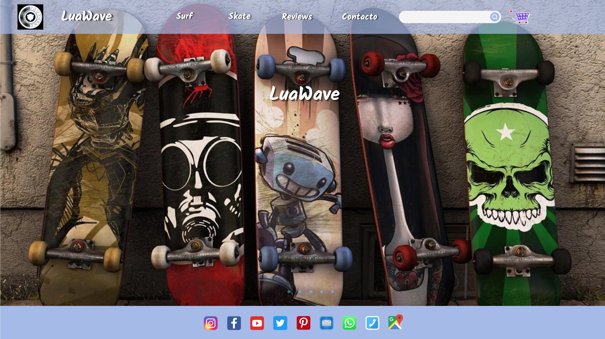
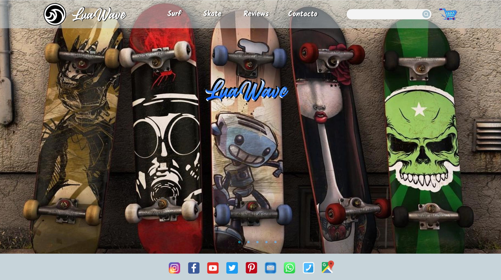
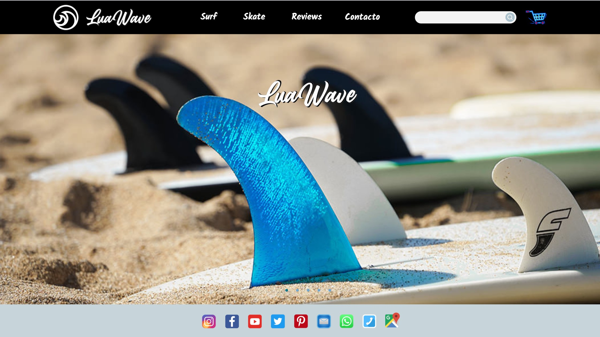
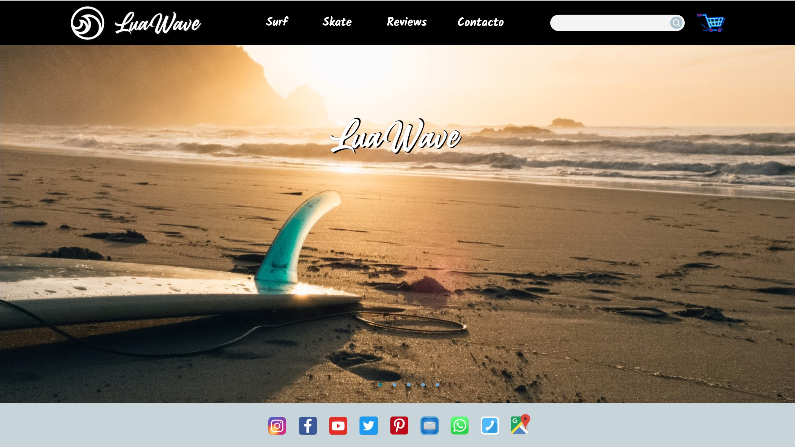
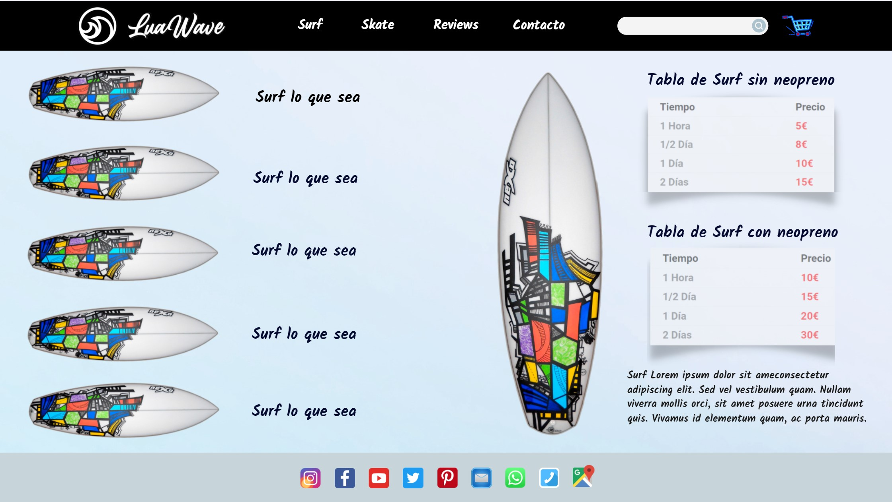
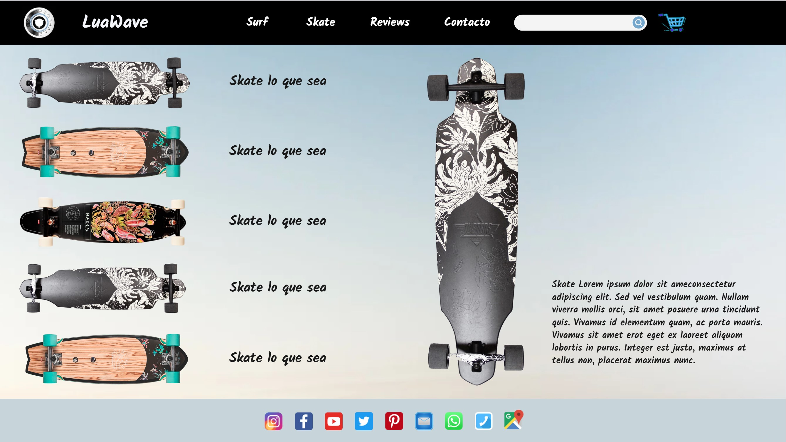

> Integrantes del grupo: Angel, Brais, Chistian, Maite.

#
# Título

# **LuaWave**

#
# Descripción

Tienda online donde se alquilan pack para hacer surf y para practicar skate, (las tablas, neopreno para el surf, casco y otros accesorios necesarios).

#
# Mockups

        En construcción...

#
# Datos

## Articles

- Articles_id (PRIMARY KEY)
- Name
- Description
- Stock
- UrlFoto 
- Price (pack para alquilar con IVA incluido)
- Categoria-id (FOREIGN KEY)
- URL / Referencia - posible enlace con Amazon (si da tiempo)

## Stock

        .....(posibilidad de complicarlo más)

## Rental

        Solo cuando compren pack para alquilar

- Rental_id (PRIMARY KEY)
- Name
- DNI / NIF
- Email
- Phone
- Code_postal

## Rental_articles

- Rental_articles_id (AUTO_INCREMENT)
- Rental_id (FOREIGN KEY)
- Articles_id (FOREIGN KEY)
- Rental_date
- Return_date
- Quantity
- Price
- Forma de pago

## Categorias

- Categorias_id (PRIMARY KEY)
- Name
- Description

## Staff

        .....(página externa) Login de acceso básico para el personal, (gestión de la base de datos).

- Staff-id (AUTO_INCREMENT)
- Name
- DNI / NIF
- Password
- Email
- Phone
- Address
- Active

#
# Endpoints

## Articles

- GET /articles/ - Devuelve la lista de artículos
  - Parámetros: Ninguno
  - Respuestas:
    - 200: ok. Devuelve:
      - [{id,name,description,stock,urlFoto,price,categoriaId}]
    - 500: Error interno de la Base de datos

--
- GET /article/{id} - Devuelve un artículo específico
  - Parámetros: 
    - id: Identificador del artículo
  - Respuestas:
    - 200: ok. Devuelve:
      - {id,name,description,stock,urlFoto,price,categoriaId}
    - 404: Artículo no encontrado
    - 500: Error interno de la Base de datos

--
- POST /article/ - Crea un nuevo artículo (se genera el id)
  - Parámetros: 
    - {name,description,stock,urlFoto,price,categoriaId}
  - Respuestas:
    - 201: Creado ok. Devuelve: {id}
    - 400: Petición incorrecta. Error del cliente
    - 401: No autorizado o incorrecto
    - 500: Error interno de la Base de datos

--
- PUT /article/{id} - Modificar un artículo
  - Parámetros: 
    - id: Identificador del artículo
    - {name,description,stock,urlFoto,price,categoriaId}
  - Respuestas:
    - 200: Modificado ok. Devuelve:
      - {id,name,description,stock,urlFoto,price,categoriaId}
    - 400: Petición incorrecta. Error del cliente
    - 401: No autorizado o incorrecto
    - 404: Artículo no encontrado
    - 500: Error interno de la Base de datos

--
- PATCH

  Hacer modificaciones parciales o concretas de los artículos.

  (Probablemente no se utilice)

--
- DELETE /article/{id} - Eliminar un artículo
  - Parámetros: 
    - id: Identificador del artículo
    - {name,description,stock,urlFoto,price,categoriaId}
  - Respuestas:
    - 200: Eliminado ok. Devuelve:
      - {id,name,description,stock,urlFoto,price,categoriaId}
    - 400: Petición incorrecta. Error del cliente
    - 401: No autorizado o incorrecto
    - 404: Artículo no encontrado
    - 500: Error interno de la Base de datos

## Users (Rental)

- GET /users/ - Devuelve la lista de usuarios
  - Parámetros: Ninguno
  - Respuestas:
    - 200: ok. Devuelve:
      - [{id,name,dni,email,phone,codePostal}]
    - 500: Error interno de la Base de datos

--
- GET /user/{id} - Devuelve un usuario específico
  - Parámetros: 
    - id: Identificador del usuario
  - Respuestas:
    - 200: ok. Devuelve:
      - {id,name,dni,email,phone,codePostal}
    - 404: Usuario no encontrado
    - 500: Error interno de la Base de datos

--
- POST /user/ - Crea un nuevo usuario
  - Parámetros: 
    - {name,dni,email,phone,codePostal}
  - Respuestas:
    - 201: Creado ok. Devuelve: {id}
    - 400: Petición incorrecta. Error del cliente
    - 401: No autorizado o incorrecto
    - 500: Error interno de la Base de datos

--
- PUT /user/{id} - Modificar un usuario
  - Parámetros: 
    - id: Identificador del usuario
    - {name,dni,email,phone,codePostal}
  - Respuestas:
    - 200: Modificado ok. Devuelve:
      - {id,name,dni,email,phone,codePostal}
    - 400: Petición incorrecta. Error del cliente
    - 401: No autorizado o incorrecto
    - 404: Usuario no encontrado
    - 500: Error interno de la Base de datos

--
- DELETE /user/{id} - Eliminar un usuario
  - Parámetros: 
    - id: Identificador del usuario
    - {name,dni,email,phone,codePostal}
  - Respuestas:
    - 200: Eliminado ok. Devuelve:
      - {id,name,dni,email,phone,codePostal}
    - 400: Petición incorrecta. Error del cliente
    - 401: No autorizado o incorrecto
    - 404: Usuario no encontrado
    - 500: Error interno de la Base de datos

## Cart (Rental_articles)

- GET /cart/ - Devuelve una lista con los artículos añadidos al carrito.
  - Parámetros: Ninguno
  - Respuestas:
    - 200: ok. Devuelve:
      - [{id,nameArticle,categoria,photo,quantity,price}] DUDAS parámetros
    - 500: Error interno de la Base de datos

 --
- POST /cart/ - Añade artículos al carrito

  Crea carrito inicial vacío que identifique al cliente, y se irá modificando con PUT. 

  - Parámetros:
    - id: Identificador DUDAS id del artículo o específico del carrito  
    - {nameArticle,categoria,photo,quantity,price} DUDAS parámetros
  - Respuestas:
    - 201: Añadido ok. Devuelve: {id}
    - 400: Petición incorrecta. Error del cliente
    - 401: No autorizado o incorrecto
    - 500: Error interno de la Base de datos

--
- PUT /cart/{id} - Modifica el carrito DUDAS (todo el carrito o por id) 
  - Parámetros: 
    - id: Identificador del artículo
    - {nameArticle,categoria,photo,quantity,price} DUDAS parámetros
  - Respuestas:
    - 200: Modificado ok. Devuelve:
      - {id,nameArticle,categoria,photo,quantity,price} DUDAS parámetros
    - 400: Petición incorrecta. Error del cliente
    - 401: No autorizado o incorrecto
    - 404: Artículo no encontrado
    - 500: Error interno de la Base de datos

--
- DELETE /cart/{id} - Elimina un artículo del carrito
  - Parámetros: 
    - id: Identificador del artículo
    - {nameArticle,categoria,photo,quantity,price} DUDAS parámetros 
  - Respuestas:
    - 200: Eliminado ok. Devuelve:
      - {id,nameArticle,categoria,photo,quantity,price} DUDAS parámetros
    - 400: Petición incorrecta. Error del cliente
    - 401: No autorizado o incorrecto
    - 404: Artículo no encontrado
    - 500: Error interno de la Base de datos

## Categorias

## Staff

        .....(página externa) 

