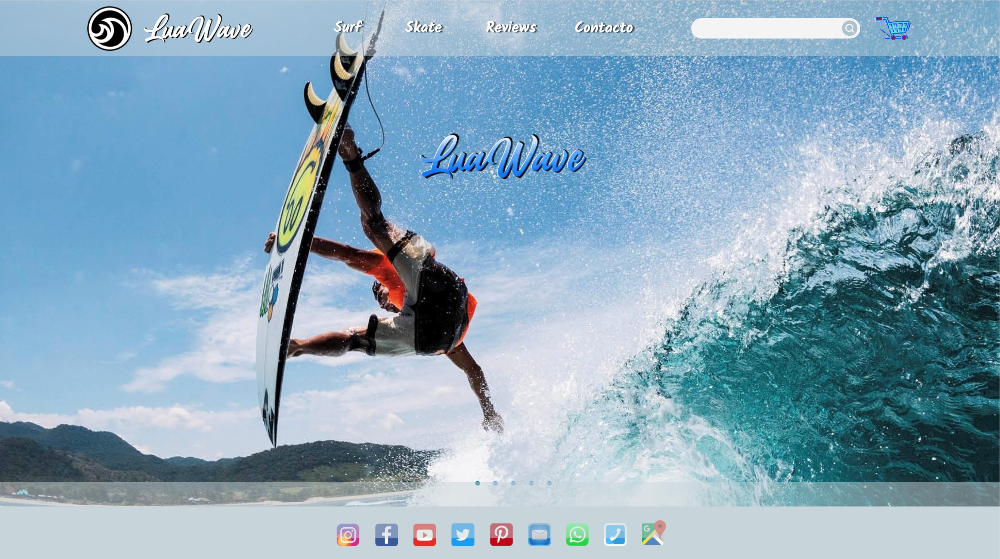
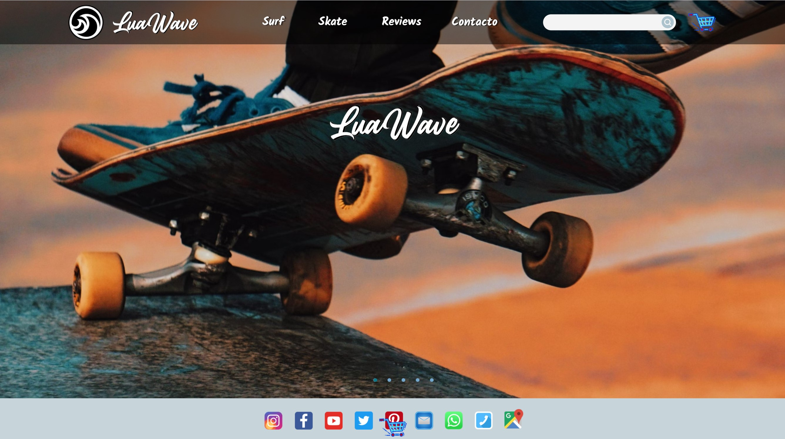

> Integrantes del grupo: Angel, Brais, Chistian, Maite.

#
# Título

# **LuaWave**

#
# Descripción

Tienda online donde se alquilan pack para hacer surf y para practicar skate, (las tablas, neopreno para el surf, casco y otros accesorios necesarios).

#
# Mockups

        En construcción...

#
# Datos

## Articles

- Articles_id (PRIMARY KEY)
- Name
- Description
- Stock
- UrlFoto 
- Price (pack para alquilar con IVA incluido)
- Categoria-id (FOREIGN KEY)
- URL / Referencia - posible enlace con Amazon (si da tiempo)

## Stock

        .....(posibilidad de complicarlo más)

## Rental

        Solo cuando compren pack para alquilar

- Rental_id (PRIMARY KEY)
- Name
- DNI / NIF
- Email
- Phone
- Code_postal

## Rental_articles

- Rental_articles_id (AUTO_INCREMENT)
- Rental_id (FOREIGN KEY)
- Articles_id (FOREIGN KEY)
- Rental_date
- Return_date
- Quantity
- Price
- Forma de pago

## Categorias

- Categorias_id (PRIMARY KEY)
- Name
- Description

## Staff

        .....(página externa) Login de acceso básico para el personal, (gestión de la base de datos).

- Staff-id (AUTO_INCREMENT)
- Name
- DNI / NIF
- Password
- Email
- Phone
- Address
- Active

#
# Endpoints

## Articles

- GET /articles/ - Devuelve la lista de artículos
  - Parámetros: Ninguno
  - Respuestas:
    - 200: ok. Devuelve:
      - [{articles_id,name,description,stock,photo,price,categoria}]
    - 500: Error interno de la Base de datos

--
- GET /article/{id} - Devuelve un artículo específico
  - Parámetros: 
    - id: Identificador del artículo
  - Respuestas:
    - 200: ok. Devuelve:
      - {articles_id,name,description,stock,photo,price,categoria}
    - 404: Artículo no encontrado
    - 500: Error interno de la Base de datos

--
- POST /article/ - Crea un nuevo artículo (se genera el id)
  - Parámetros: 
    - {name,description,stock,photo,price,categoria}
  - Respuestas:
    - 201: Creado ok. Devuelve: {id}
    - 400: Petición incorrecta. Error del cliente
    - 401: No autorizado o incorrecto
    - 500: Error interno de la Base de datos

--
- PUT /article/{id} - Modificar un artículo
  - Parámetros: 
    - id: Identificador del artículo
    - {name,description,stock,photo,price,categoria}
  - Respuestas:
    - 200: Modificado ok. Devuelve:
      - {articles_id,name,description,stock,urlFoto,price,categoriaId}
    - 400: Petición incorrecta. Error del cliente
    - 401: No autorizado o incorrecto
    - 404: Artículo no encontrado
    - 500: Error interno de la Base de datos

--
- PATCH

  Hacer modificaciones parciales o concretas de los artículos.

  (Probablemente no se utilice)

--
- DELETE /article/{id} - Eliminar un artículo
  - Parámetros: 
    - id: Identificador del artículo
  - Respuestas:
    - 200: Eliminado ok. 
    - 400: Petición incorrecta. Error del cliente
    - 401: No autorizado o incorrecto
    - 404: Artículo no encontrado
    - 500: Error interno de la Base de datos

## Pedido

- GET /pedidos/ - Devuelve una lista con los artículos añadidos al carrito.
  - Parámetros: Ninguno
  - Respuestas:
    - 200: ok. Devuelve:
      - [{rental_articles_id,name,dni,email,phone,code_postal,articles_id,name,categoria,quantity}] (objeto esta construido en los controladores con los datos de Articles, Rental_articles, y Rental)
    - 500: Error interno de la Base de datos
    

 --
- POST /pedido/ - Genera id del pedido

  Crea carrito inicial vacío que identifique al cliente, y se irá modificando con PUT. 

  - Parámetros:
    - id: Identificador del pedido  
    - {name,dni,email,phone,code_postal,articles_id,name,categoria,quantity} 
  - Respuestas:
    - 201: Añadido ok. Devuelve: {id}
    - 400: Petición incorrecta. Error del cliente
    - 401: No autorizado o incorrecto
    - 500: Error interno de la Base de datos

--
- PUT /pedido/{id} - Modifica los artículos del pedido.  
  - Parámetros: 
    - id: Identificador del pedido
    - {name,dni,email,phone,code_postal,articles_id,name,categoria,quantity} 
  - Respuestas:
    - 200: Modificado ok. Devuelve:
      - {rental_articles_id,name,dni,email,phone,code_postal,articles_id,name,categoria,quantity} 
    - 400: Petición incorrecta. Error del cliente
    - 401: No autorizado o incorrecto
    - 404: Artículo no encontrado
    - 500: Error interno de la Base de datos

--
- DELETE /pedido/{id} - Elimina artículos del pedido
  - Parámetros: 
    - id: Identificador del pedido
  - Respuestas:
    - 200: Eliminado ok.
    - 400: Petición incorrecta. Error del cliente
    - 401: No autorizado o incorrecto
    - 404: Artículo de pedido no encontrado
    - 500: Error interno de la Base de datos

## Categorias

## Staff

        .....(página externa) 

