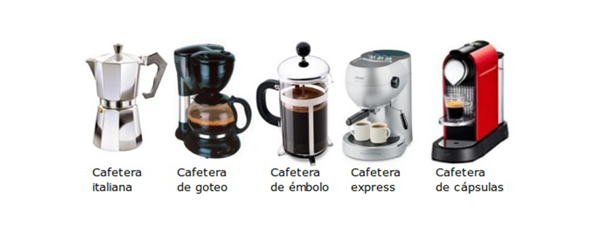

## Título
Tienda online de venta de cafeteras.

## Descripción
La tienda venderá los diversos tipos de cafeteras que hay, cafés y accesorios para las mismas.

## Necesidad que soluciona
Sería una tienda especializada en cafeteras y sus productos, facilitando al cliente encontrar en la mismas todo lo que busque.

## Target
Para todo el mundo que leguste el café, y bebidas solubles en capsulas.

## Mockups
- Diferentes secciones, para las cafeteras, el café y las capsulas, y accesorios.
- Estas secciones se enlazaran entre si desde el navegador.
- La versión movil solo se mostrará de manera vertical.
- Una sección del navegador sera de contacto.
- El formulario de registro, pedirá nombre, apellidos, fecha de nacimiento, teléfono, email, y contraseña.
- La página de inicio tendrá una imagen de fondo de pantalla llamatiba.

## MVP
Funcionalidades mínimas para el funcionamiento de la aplicación:
  - La tienda online necesitará que el cliente se registre para realizar la compra.
  - Cada producto a la venta, tendrá un título, con una imagen y un botón de comprar.
  - Una vez el producto comprado se añadirá a un carrito de la compra.
  - El carrito mostrara un pequeña imagen del producto, la cantidad de producto comprado, el precio, y la aplicación de Iva.
  - Para facilitar al cliente encontar el producto que busca tendrá un buscador.
  - En la parte inferior saldrá una galería de imagenes, relacionada con los productos buscados.
